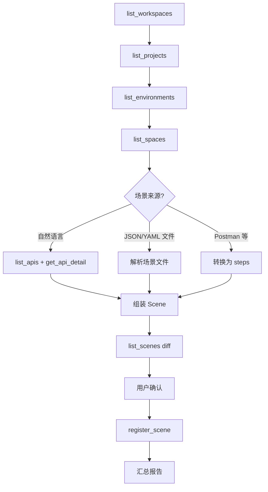

# Axiom 场景注册

将测试场景（多步 API 编排）注册到 Axiom 指定编排空间。依赖已注册的 API（`list_apis` / `get_api_detail`），通过 MCP 写入场景。

## 黄金规则

- **必须先有 API**：步骤的 `method + path` 应能在项目中找到已注册 API；找不到时警告用户先运行 `axiom-api-register` skill 或 UI 导入。
- **必须先确认再写入**：任何 `register_scene` 前，展示场景名称、步骤清单（含依赖关系）并得到用户确认。
- **默认只读业务代码**：本 skill 读取场景定义文件或根据自然语言组装场景，不修改业务代码。
- **变量链必须闭合**：后序步骤引用的 `{{var}}` 必须在前序 `extract_script` 产出或 `variables` 中定义。
- **建议带 baseUrl**：`variables` 中应有 `baseUrl`（`type: static`），否则执行时可能无法解析请求地址。
- **步骤 ID 由服务层分配**：`register_scene` 的 steps **不要**传 `id`；落库后格式为 `{method}_{path_slug}_{xx}`（如 `post_api_login_ab`），与 UI / NLP 一致。
- **批量操作要有 diff 和进度**：注册前对比已有场景，注册后汇总新增/覆盖/跳过/失败。

## 客户端兼容

文中的 `AskQuestion` 表示向用户提出选择，并非必须存在的工具名。使用客户端可用的问答工具；没有时用简短文字提问。沿用用户已明确指定的工作区、项目及操作范围；只有缺少必要信息时才询问。MCP 需单独配置，本仓库不包含凭据；以实际服务暴露的工具参数为准。

## 前置条件

用户需在所用客户端中配置指向 Axiom 的 MCP endpoint（与 API 注册 skill 相同）。服务端版需 JWT；桌面版通常仅需 `url`。

## 快速决策树

1. **选择工作区**：`list_workspaces` → 一个自动选，多个 `AskQuestion`
2. **选择项目**：`list_projects` → 一个自动选，多个 `AskQuestion`，没有则停止
3. **选择环境**：`list_environments`（传 `project_id`）→ 同上
4. **选择编排空间**：`list_spaces`（传 `project_id` + `environment_id`）→ 同上
5. **探测场景来源**（见下文）
6. **加载 API 目录**：`list_apis` + 按需 `get_api_detail`
7. **组装场景**：steps / variables / assertions / extract
8. **Diff**：`list_scenes` 按 `name` 对比 `[new]` / `[update]` / `[skip]`
9. **用户确认** → `register_scene`
10. **汇总报告**



## 场景来源探测

按优先级：

### 优先级 1 — 仓库内场景定义文件（最可靠）

检查：`scenes/*.json`、`test/scenes/*.yaml`、`fixtures/orchestration/*.json`、`.axiom/scenes/*.json`

解析 JSON/YAML 后直接映射为 `register_scene` 参数。校验其中 API 引用是否在 `list_apis` 中存在。

### 优先级 2 — 自然语言描述

用户描述业务流程，例如：「先登录拿 token，再查用户信息」。

流程：
1. `list_apis` 搜索相关 API（按 path/description/module 匹配）
2. `get_api_detail` 获取 request/response example
3. 组装顺序步骤、extract、断言、变量引用
4. 展示确认

### 优先级 3 — Postman / HTTP 测试脚本

若发现 `.postman_collection.json` 或类似文件，转换为 steps（每项请求 → 一步）。集合变量 → scene variables。

**不替代 UI NLP 编排**：复杂 DAG、跨项目编排建议用户使用 Axiom「NLP 编排」界面；本 skill 适合结构化导入或明确的多步流程。

## 从 API 构建步骤

对每个 API 步骤：

| 字段 | 来源 |
|------|------|
| `request.method` / `request.path` | 已注册 API |
| `request.body` | `get_api_detail` 的 `request_body_example`，或按 schema 合成 |
| `request.headers` | 需要认证时加 `Authorization: Bearer {{token}}` |
| `assertions` | 至少 `status eq 200`；有响应字段时加 `jsonpath exists` |
| `extract_script` | 从 `response_body_example` 推断需提取的字段 |

### extract_script 示例

登录步骤提取 token：

```javascript
const body = JSON.parse(response.body);
return { token: body.data.token };
```

后续步骤 headers：

```json
{"Authorization": "Bearer {{token}}"}
```

### 变量引用格式

- 场景变量：`{{baseUrl}}`、`{{token}}`
- 步骤产出变量：在前序步骤 `extract_script` 中 `return { token: ... }` 后，后序用 `{{token}}`

## 断言生成规则

| 场景 | 断言 |
|------|------|
| 默认 | `{"type":"status","operator":"eq","expected":200}` |
| 响应含业务字段 | `{"type":"jsonpath","operator":"exists","path":"$.data.id"}` |
| 创建成功 | `{"type":"jsonpath","operator":"exists","path":"$.data"}` |
| 列表非空 | `{"type":"jsonpath","operator":"exists","path":"$.data[0]"}` |

## Diff 与确认

注册前 `list_scenes`：

```json
{"space_id": "sp-001"}
```

按 `name` 对比：
- `[new]`：新场景
- `[update]`：同名已存在，传 `scene_id` 覆盖更新
- `[skip]`：用户选择跳过

超过 10 个场景时分组确认，每组只展示名称和步骤数摘要。

示例：

```text
即将注册到编排空间「默认空间」：

[new]    用户登录后查详情     — 2 步
[update] 商品列表分页测试       — 3 步（将覆盖 scene-abc）
[skip]   已有冒烟场景           — 已存在，跳过

共 3 个：新增 1 / 覆盖 1 / 跳过 1
```

## register_scene 调用

用户确认后调用。创建不传 `scene_id`；覆盖更新传已有 `scene_id`。

建议同时传 `project_id` 以触发 API 引用校验（未注册 API 会返回警告但不阻断）。

完整示例见 [examples.md](examples.md)；字段说明见 [scene-schema.md](scene-schema.md)。

## 汇总报告

```text
场景注册完成

编排空间：默认空间（sp-001）
新增成功：2
覆盖成功：1
跳过：1
失败：0
警告：1

警告：
- 场景「快速冒烟」步骤「查订单」无 jsonpath 断言

建议：在 Axiom 界面打开场景执行验证，或调用 get_scene 查看详情。
```

## Token 过期

与 API 注册 skill 相同：识别 `Token 已过期` / `401` 后立即停止，引导用户更新 MCP 配置。

## 与 API 注册 skill 的配合

推荐工作流：

1. `axiom-api-register` — 注册 API
2. `axiom-scene-register` — 基于已注册 API 创建场景

若 API 未注册，先完成 API 注册再继续场景注册。
